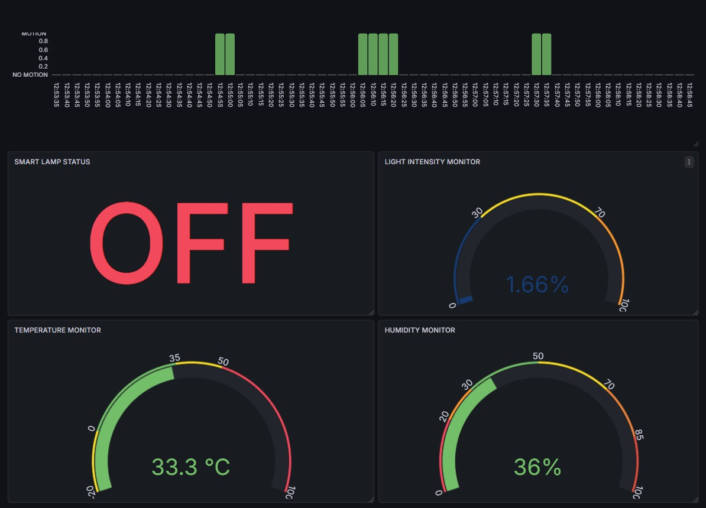
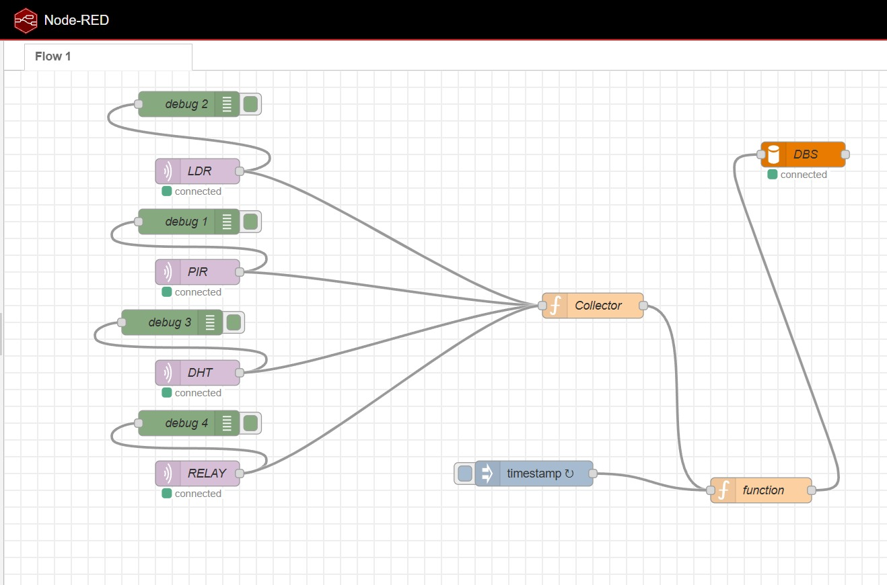

# 🔌 An MQTT-Driven Edge Sensing System for Energy-Efficient Lighting Control

## 📌 Overview

This project implements a **real-time IoT-based smart lighting system** that optimizes energy consumption using environmental sensing and automation logic.

It demonstrates a **complete IoT pipeline**:

> Data Acquisition → Communication → Processing → Storage → Visualization

---

## 🚀 Key Features

* ⚡ Motion-based automatic lighting (PIR)
* 🌙 Ambient light-based control (LDR)
* ⏱ Timer-based auto OFF system
* 📱 Manual control via mobile
* 🔁 Dual modes: AUTO & MANUAL
* 📊 Real-time monitoring dashboard (Grafana)

---

## 🧠 System Architecture

```
Sensors → ESP8266 → MQTT (dev.coppercloud.in)
        → Node-RED → MySQL → Grafana
```

---

## 🧰 Hardware Components

* ESP8266 (NodeMCU)
* DHT11 Sensor (Temperature & Humidity)
* PIR Sensor (Motion Detection)
* LDR Sensor (Light Intensity)
* Relay Module (Lighting Control)

---

## 💻 Tech Stack

* MQTT Broker: dev.coppercloud.in
* Arduino IDE (ESP8266 Programming)
* Node-RED (Data Processing)
* MySQL (Database Storage)
* Grafana (Visualization Dashboard)

---

## ⚙️ Working Logic

### AUTO Mode:

* If **motion detected (PIR = 1)** AND **low light (LDR)** → Light ON
* If **no motion for specific duration** → Light OFF

### MANUAL Mode:

* User controls relay via mobile
* Overrides automation

---

## 📊 Dashboard Preview

### 📈 Grafana Dashboard



### 🔄 Node-RED Flow



---

## 📂 Project Structure

```
project-iot/
 ├── esp8266_code/
 ├── node-red/
 ├── database/
 ├── dashboard/
 ├── images/
```

---

## 🌟 Why This Project is Different

* ✅ End-to-end IoT pipeline implementation
* ✅ Real-time MQTT communication
* ✅ Data persistence using MySQL
* ✅ Analytics dashboard using Grafana
* ✅ Supports both automation and manual control

---

## 🔮 Future Scope

* AI-based motion prediction
* Energy usage analytics
* Multi-room scalability
* Mobile app integration

---
## 👨‍💻 Author
**Vaibhav (xyron24)**
---

## 📌 Conclusion

This system demonstrates how IoT can be used to build **intelligent, energy-efficient automation systems** using real-time data and analytics.
